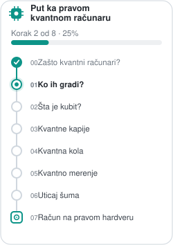

:::{margin}

:::


## Pejzaž hardvera za kvantno računarstvo;  avgust 2026 (nepotpuno)[^history]

Svaki panel je jedna **fizička platforma kubita**. Unutar panela subjekti su razvrstani
u kolone:
- velike kompanije,
- startapi,
- univerzitetske laboratorije.

Ideja ove liste jeste da pruži pregled različitih načina na koje se danas grade kvantni računari.


<div style="display:flex;flex-wrap:wrap;align-items:center;gap:8px;margin:0 0 1.25rem;font-size:0.82rem;"><span style="font-weight:600;">Legenda:</span><span style="padding:2px 10px;border-radius:20px;background:#E6F1FB;color:#0C447C;">Velika kompanija</span><span style="padding:2px 10px;border-radius:20px;background:#E1F5EE;color:#0F6E56;">Startap</span><span style="padding:2px 10px;border-radius:20px;background:#FAEEDA;color:#854F0B;">Univerzitetska laboratorija</span><span style="opacity:0.6;margin-left:auto;">&#8599; = referenca</span></div>

<div style="border:1px solid rgba(128,128,128,0.28);border-radius:12px;overflow:hidden;margin:0 0 14px;"><div style="display:flex;align-items:baseline;flex-wrap:wrap;gap:10px;padding:10px 16px;background:rgba(128,128,128,0.09);border-bottom:1px solid rgba(128,128,128,0.22);"><span style="font-weight:600;font-size:1.05rem;">Superprovodni kubiti</span><span style="font-size:0.78rem;opacity:0.62;">transmoni i „cat“ kubiti </span></div><div style="display:grid;grid-template-columns:repeat(3,minmax(0,1fr));"><div style="padding:12px 16px;border-right:1px solid rgba(128,128,128,0.18);"><div style="font-size:0.68rem;text-transform:uppercase;letter-spacing:0.06em;opacity:0.6;margin-bottom:8px;">Velike kompanije</div><div style="display:flex;flex-direction:column;gap:6px;"><span style="display:flex;flex-wrap:wrap;align-items:baseline;gap:6px;padding:5px 10px;border-radius:8px;font-size:0.82rem;line-height:1.3;text-decoration:none;box-sizing:border-box;background:#E6F1FB;color:#0C447C;"><span style="font-weight:500;">IBM</span><span style="font-size:0.7rem;opacity:0.75;">fiksni ali i podešljivi transmoti </span><span style="margin-left:auto;font-size:0.78rem;padding-left:4px;"><a href="https://doi.org/10.48550/arXiv.2410.00916" aria-label="referenca">&#8599;</a></span></span><span style="display:flex;flex-wrap:wrap;align-items:baseline;gap:6px;padding:5px 10px;border-radius:8px;font-size:0.82rem;line-height:1.3;text-decoration:none;box-sizing:border-box;background:#E6F1FB;color:#0C447C;"><span style="font-weight:500;">Google</span><span style="font-size:0.7rem;opacity:0.75;">podešljivi transmoni</span><span style="margin-left:auto;font-size:0.78rem;padding-left:4px;"><a href="https://doi.org/10.1038/s41586-019-1666-5" aria-label="referenca">&#8599;</a></span></span><span style="display:flex;flex-wrap:wrap;align-items:baseline;gap:6px;padding:5px 10px;border-radius:8px;font-size:0.82rem;line-height:1.3;text-decoration:none;box-sizing:border-box;background:#E6F1FB;color:#0C447C;"><span style="font-weight:500;">Amazon</span><span style="font-size:0.7rem;opacity:0.75;">„cat“ kubiti</span><span style="margin-left:auto;font-size:0.78rem;padding-left:4px;"><a href="https://doi.org/10.1038/s41586-025-08642-7" aria-label="referenca">&#8599;</a></span></span></div></div><div style="padding:12px 16px;border-right:1px solid rgba(128,128,128,0.18);"><div style="font-size:0.68rem;text-transform:uppercase;letter-spacing:0.06em;opacity:0.6;margin-bottom:8px;">Startapovi</div><div style="display:flex;flex-direction:column;gap:6px;"><span style="display:flex;flex-wrap:wrap;align-items:baseline;gap:6px;padding:5px 10px;border-radius:8px;font-size:0.82rem;line-height:1.3;text-decoration:none;box-sizing:border-box;background:#E1F5EE;color:#0F6E56;"><span style="font-weight:500;">Rigetti</span><span style="font-size:0.7rem;opacity:0.75;">podešljivi transmoni</span><span style="margin-left:auto;font-size:0.78rem;padding-left:4px;"><a href="https://doi.org/10.1126/sciadv.aao3603" aria-label="referenca">&#8599;</a></span></span><span style="display:flex;flex-wrap:wrap;align-items:baseline;gap:6px;padding:5px 10px;border-radius:8px;font-size:0.82rem;line-height:1.3;text-decoration:none;box-sizing:border-box;background:#E1F5EE;color:#0F6E56;"><span style="font-weight:500;">IQM</span><span style="font-size:0.7rem;opacity:0.75;">podešljivi transmoni</span><span style="margin-left:auto;font-size:0.78rem;padding-left:4px;"><a href="https://doi.org/10.48550/arXiv.2408.12433" aria-label="referenca">&#8599;</a></span></span><span style="display:flex;flex-wrap:wrap;align-items:baseline;gap:6px;padding:5px 10px;border-radius:8px;font-size:0.82rem;line-height:1.3;text-decoration:none;box-sizing:border-box;background:#E1F5EE;color:#0F6E56;"><span style="font-weight:500;">Alice &amp; Bob</span><span style="font-size:0.7rem;opacity:0.75;">„cat“ kubiti</span><span style="margin-left:auto;font-size:0.78rem;padding-left:4px;"><a href="https://doi.org/10.1038/s41586-024-07294-3" aria-label="referenca">&#8599;</a></span></span><span style="display:flex;flex-wrap:wrap;align-items:baseline;gap:6px;padding:5px 10px;border-radius:8px;font-size:0.82rem;line-height:1.3;text-decoration:none;box-sizing:border-box;background:#E1F5EE;color:#0F6E56;"><span style="font-weight:500;">Nord Quantique</span><span style="font-size:0.7rem;opacity:0.75;">bozonski kubit?</span><span style="margin-left:auto;font-size:0.78rem;padding-left:4px;"><a href="https://doi.org/10.1103/PhysRevLett.132.150607" aria-label="referenca">&#8599;</a></span></span><span style="display:flex;flex-wrap:wrap;align-items:baseline;gap:6px;padding:5px 10px;border-radius:8px;font-size:0.82rem;line-height:1.3;text-decoration:none;box-sizing:border-box;background:#E1F5EE;color:#0F6E56;"><span style="font-weight:500;">Oxford Quantum Computing</span></span></div></div><div style="padding:12px 16px;"><div style="font-size:0.68rem;text-transform:uppercase;letter-spacing:0.06em;opacity:0.6;margin-bottom:8px;">Univerzitetske laboratorije</div><div style="display:flex;flex-direction:column;gap:6px;"><span style="display:flex;flex-wrap:wrap;align-items:baseline;gap:6px;padding:5px 10px;border-radius:8px;font-size:0.82rem;line-height:1.3;text-decoration:none;box-sizing:border-box;background:#FAEEDA;color:#854F0B;"><span style="font-weight:500;">A. Wallraff &middot; ETH Zürich</span><span style="margin-left:auto;font-size:0.78rem;padding-left:4px;"><a href="https://doi.org/10.1038/s41586-022-04566-8" aria-label="referenca">&#8599;</a></span></span><span style="display:flex;flex-wrap:wrap;align-items:baseline;gap:6px;padding:5px 10px;border-radius:8px;font-size:0.82rem;line-height:1.3;text-decoration:none;box-sizing:border-box;background:#FAEEDA;color:#854F0B;"><span style="font-weight:500;">W. D. Oliver &middot; MIT</span><span style="margin-left:auto;font-size:0.78rem;padding-left:4px;"><a href="https://doi.org/10.1103/PhysRevX.11.021058" aria-label="referenca">&#8599;</a></span></span><span style="display:flex;flex-wrap:wrap;align-items:baseline;gap:6px;padding:5px 10px;border-radius:8px;font-size:0.82rem;line-height:1.3;text-decoration:none;box-sizing:border-box;background:#FAEEDA;color:#854F0B;"><span style="font-weight:500;">Fei Yan &middot; BAQIS</span><span style="margin-left:auto;font-size:0.78rem;padding-left:4px;"><a href="https://doi.org/10.1038/s41567-025-02990-x" aria-label="referenca">&#8599;</a></span></span><span style="display:flex;flex-wrap:wrap;align-items:baseline;gap:6px;padding:5px 10px;border-radius:8px;font-size:0.82rem;line-height:1.3;text-decoration:none;box-sizing:border-box;background:#FAEEDA;color:#854F0B;"><span style="font-weight:500;">Devoret, Schöllkopf &middot; Yale</span></span><span style="display:flex;flex-wrap:wrap;align-items:baseline;gap:6px;padding:5px 10px;border-radius:8px;font-size:0.82rem;line-height:1.3;text-decoration:none;box-sizing:border-box;background:#FAEEDA;color:#854F0B;"><span style="font-weight:500;"><a href="https://www.qtlab.unina.it/labs/icsc-qc1-quantum-computing-ccenter/">QTLab &middot; University of Naples Federico II</a></span></span></div></div></div></div>


Superprovodni kubiti su danas jedna od najnaprednijih fizičkih realizacija kvantnih računara.
Njihova osnova je otkriće da makroskopski kvantni efekti mogu da opstanu i u električnim kolima. 
To je veoma značajno, jer se kvantno-mehanički efekti obično ispoljavaju samo pod strogim uslovima i to:
- u veoma malim sistemima, na nivou atoma i molekula,
- na izuzetno niskim temperaturama.

Upravo mogućnost da kvantno stanje preživi na makroskopskoj skali tj. u kolu koje se može projektovati i proizvesti kao čip čini ovu platformu posebnom. 

Za prvobitne ali i najvažnije doprinose u toj oblasti dodeljena je Nobelova nagrada za fiziku 2025. godine.

```{figure} ../images/nobel2.png
:alt: Nobelova nagrada za fiziku 2025
:width: 660px
:align: center

Nobelova nagrada za fiziku 2025: John Clarke, Michel H. Devoret i John M. Martinis, za otkriće makroskopskog kvantnog tunelovanja i kvantizacije energije u električnim kolima. Ilustracija: Niklas Elmehed © Nobel Prize Outreach. [Nobelova nagrada 2025] (https://www.nobelprize.org/prizes/physics/2025/press-release/)
```

Ključ je u samoj superprovodnosti: na dovoljno niskim temperaturama elektroni se udružuju u tzv. Kuperove (eng. Cooper) parove i kroz materijal teku bez otpora, kao jedno kolektivno kvantno stanje opisano zajedničkom talasnom funkcijom.

```{figure} ../images/nobel1.png
:alt: Cooper-ovi parovi i Josephson-ov spoj
:width: 660px
:align: center

Od običnog provodnika do superprovodnika: elektroni se udružuju u Kuperove parove i formiraju kolektivno kvantno stanje; prekid u ilustraciji označava Josephson-ov spoj. Ilustracija: Johan Jarnestad / The Royal Swedish Academy of Sciences.
```

Da bi se od takvog kola dobio kubit, u njega se ubacuje Džosefsonov (eng. Josephson) spoj: tanka barijera koja prekida superprovodnu putanju. Bez njega, LC-kolo ima jednako raspoređene energetske nivoe i ponaša se kao običan oscilator. 


Džozefsonov spoj čini nivoe neravnomerno raspoređenim, pa se dva najniža mogu izdvojiti i koristiti kao stanja $|0\rangle$ i $|1\rangle$ što zapravo čini kubit.

```{figure} ../images/circuit.png
:alt: LC-kolo sa i bez Josephson-ovog spoja
:width: 660px
:align: center

LC-kolo bez Džozefsonov spoja ima jednako raspoređene energetske nivoe (levo); dodavanjem spoja nivoi postaju neravnomerni, pa se dva najniža izdvajaju kao kubit (desno). L je induktor, C je kondenzator. [više detalja] (https://ntt-review.jp/archive/ntttechnical.php?contents=ntr200801sp6.html).  
```

**Prednosti ove platforme:**
- operacije (kapije) su veoma brze, reda nanosekundi;
- njima se upravlja standardnim mikrotalasnim signalima i postojećom elektronikom;
- platforma je najzrelija i industrijski najrazvijenija, sa velikim ulaganjima (IBM, Google i dr.).


<div style="border:1px solid rgba(128,128,128,0.28);border-radius:12px;overflow:hidden;margin:0 0 14px;"><div style="display:flex;align-items:baseline;flex-wrap:wrap;gap:10px;padding:10px 16px;background:rgba(128,128,128,0.09);border-bottom:1px solid rgba(128,128,128,0.22);"><span style="font-weight:600;font-size:1.05rem;">Zarobljeni joni</span><span style="font-size:0.78rem;opacity:0.62;">Paul zamke &middot; Penning zamke &middot; „MAGIC“</span></div><div style="display:grid;grid-template-columns:repeat(3,minmax(0,1fr));"><div style="padding:12px 16px;border-right:1px solid rgba(128,128,128,0.18);"><div style="font-size:0.68rem;text-transform:uppercase;letter-spacing:0.06em;opacity:0.6;margin-bottom:8px;">Velike kompanije</div><div style="display:flex;flex-direction:column;gap:6px;"><span style="font-size:0.78rem;opacity:0.45;font-style:italic;">&#8212; nema &#8212;</span></div></div><div style="padding:12px 16px;border-right:1px solid rgba(128,128,128,0.18);"><div style="font-size:0.68rem;text-transform:uppercase;letter-spacing:0.06em;opacity:0.6;margin-bottom:8px;">Startapovi</div><div style="display:flex;flex-direction:column;gap:6px;"><span style="display:flex;flex-wrap:wrap;align-items:baseline;gap:6px;padding:5px 10px;border-radius:8px;font-size:0.82rem;line-height:1.3;text-decoration:none;box-sizing:border-box;background:#E1F5EE;color:#0F6E56;"><span style="font-weight:500;">Quantinuum</span><span style="font-size:0.7rem;opacity:0.75;">ex-Honeywell + Cambridge Q.</span><span style="margin-left:auto;font-size:0.78rem;padding-left:4px;"><a href="https://doi.org/10.1038/s41586-021-03318-4" aria-label="referenca">&#8599;</a></span></span><span style="display:flex;flex-wrap:wrap;align-items:baseline;gap:6px;padding:5px 10px;border-radius:8px;font-size:0.82rem;line-height:1.3;text-decoration:none;box-sizing:border-box;background:#E1F5EE;color:#0F6E56;"><span style="font-weight:500;">IonQ</span><span style="margin-left:auto;font-size:0.78rem;padding-left:4px;"><a href="https://www.ionq.com/" aria-label="referenca">&#8599;</a></span></span><span style="display:flex;flex-wrap:wrap;align-items:baseline;gap:6px;padding:5px 10px;border-radius:8px;font-size:0.82rem;line-height:1.3;text-decoration:none;box-sizing:border-box;background:#E1F5EE;color:#0F6E56;"><span style="font-weight:500;">Oxford Ionics</span><span style="font-size:0.7rem;opacity:0.75;">pripojen IonQ-u</span><span style="margin-left:auto;font-size:0.78rem;padding-left:4px;"><a href="https://arxiv.org/abs/2510.17286" aria-label="referenca">&#8599;</a></span></span><span style="display:flex;flex-wrap:wrap;align-items:baseline;gap:6px;padding:5px 10px;border-radius:8px;font-size:0.82rem;line-height:1.3;text-decoration:none;box-sizing:border-box;background:#E1F5EE;color:#0F6E56;"><span style="font-weight:500;">EleQtron</span><span style="font-size:0.7rem;opacity:0.75;">mikrotalasni „MAGIC“</span></span><span style="display:flex;flex-wrap:wrap;align-items:baseline;gap:6px;padding:5px 10px;border-radius:8px;font-size:0.82rem;line-height:1.3;text-decoration:none;box-sizing:border-box;background:#E1F5EE;color:#0F6E56;"><span style="font-weight:500;">NeQxt</span><span style="font-size:0.7rem;opacity:0.75;">rana faza</span><span style="margin-left:auto;font-size:0.78rem;padding-left:4px;"><a href="https://www.neqxt.org/products/ion-trap/" aria-label="referenca">&#8599;</a></span></span><span style="display:flex;flex-wrap:wrap;align-items:baseline;gap:6px;padding:5px 10px;border-radius:8px;font-size:0.82rem;line-height:1.3;text-decoration:none;box-sizing:border-box;background:#E1F5EE;color:#0F6E56;"><span style="font-weight:500;">Züriq</span><span style="font-size:0.7rem;opacity:0.75;">Penning zamke</span></span><span style="display:flex;flex-wrap:wrap;align-items:baseline;gap:6px;padding:5px 10px;border-radius:8px;font-size:0.82rem;line-height:1.3;text-decoration:none;box-sizing:border-box;background:#E1F5EE;color:#0F6E56;"><span style="font-weight:500;">Alpine Quantum Tech.</span><span style="font-size:0.7rem;opacity:0.75;">linearne Paul zamke</span></span></div></div><div style="padding:12px 16px;"><div style="font-size:0.68rem;text-transform:uppercase;letter-spacing:0.06em;opacity:0.6;margin-bottom:8px;">Univerzitetske laboratorije</div><div style="display:flex;flex-direction:column;gap:6px;"><span style="display:flex;flex-wrap:wrap;align-items:baseline;gap:6px;padding:5px 10px;border-radius:8px;font-size:0.82rem;line-height:1.3;text-decoration:none;box-sizing:border-box;background:#FAEEDA;color:#854F0B;"><span style="font-weight:500;">Innsbruck</span><span style="font-size:0.7rem;opacity:0.75;">Blatt, Schindler, Ringbauer</span></span><span style="display:flex;flex-wrap:wrap;align-items:baseline;gap:6px;padding:5px 10px;border-radius:8px;font-size:0.82rem;line-height:1.3;text-decoration:none;box-sizing:border-box;background:#FAEEDA;color:#854F0B;"><span style="font-weight:500;">Duke</span><span style="font-size:0.7rem;opacity:0.75;">Monroe, Brown</span></span><span style="display:flex;flex-wrap:wrap;align-items:baseline;gap:6px;padding:5px 10px;border-radius:8px;font-size:0.82rem;line-height:1.3;text-decoration:none;box-sizing:border-box;background:#FAEEDA;color:#854F0B;"><span style="font-weight:500;">J. Home &middot; ETH Zürich</span></span><span style="display:flex;flex-wrap:wrap;align-items:baseline;gap:6px;padding:5px 10px;border-radius:8px;font-size:0.82rem;line-height:1.3;text-decoration:none;box-sizing:border-box;background:#FAEEDA;color:#854F0B;"><span style="font-weight:500;">C. Wunderlich &middot; Siegen</span></span></div></div></div></div>

Zarobljeni joni su danas jedna od najpreciznijih realizacija kubita. Kubiti su pojedinačni naelektrisani atomi koje elektromagnetne zamke (najčešće linearne Paul-ove) drže u vakuumu, dok se njihova stanja pripremaju, kontrolišu i očitavaju laserima.

Prednosti su značajne: svi joni jedne vrste su međusobno identični, pa nema proizvodnih odstupanja kao kod čvrstotelnih kubita, koherencija je duga, a operacije veoma tačne. Uz to, joni u istom registru mogu direktno da interaguju svaki sa svakim („all-to-all“ povezanost), što pojednostavljuje mnoge algoritme. Glavna cena su sporije operacije i teže skaliranje na veliki broj jona u jednoj zamci.

Ispod možete videti više detalja oko ove realizacije.

```{figure} ../images/trapped_ions.png
:alt: Kvantne kapije između zarobljenih jona
:width: 660px
:align: center

Kvantna kapija između dva jona: laserski snopovi nišane pojedinačne jone u nizu (razmak ~4 μm) i posreduju u interakciji između njih, čime se ostvaruje dvokubitna operacija. Izvor: [predavanje, YouTube](https://www.youtube.com/watch?v=0-VnqtZguhc).
```

```{figure} ../images/quantinuum_racetrack.png
:alt: „Racetrack“ arhitektura zamke za jone (Quantinuum)
:width: 660px
:align: center

„Racetrack“ arhitektura (Quantinuum H2): joni se naponima na elektrodama (DC/RF) pomeraju duž prstenaste zamke i dovode u zone za izvođenje kapija i merenje. Izvor: [arXiv:2305.03828](https://arxiv.org/abs/2305.03828).
```

<div style="border:1px solid rgba(128,128,128,0.28);border-radius:12px;overflow:hidden;margin:0 0 14px;"><div style="display:flex;align-items:baseline;flex-wrap:wrap;gap:10px;padding:10px 16px;background:rgba(128,128,128,0.09);border-bottom:1px solid rgba(128,128,128,0.22);"><span style="font-weight:600;font-size:1.05rem;">Neutralni atomi</span><span style="font-size:0.78rem;opacity:0.62;">Rydbergovi atomi &middot; optičke pincete</span></div><div style="display:grid;grid-template-columns:repeat(3,minmax(0,1fr));"><div style="padding:12px 16px;border-right:1px solid rgba(128,128,128,0.18);"><div style="font-size:0.68rem;text-transform:uppercase;letter-spacing:0.06em;opacity:0.6;margin-bottom:8px;">Velike kompanije</div><div style="display:flex;flex-direction:column;gap:6px;"><span style="display:flex;flex-wrap:wrap;align-items:baseline;gap:6px;padding:5px 10px;border-radius:8px;font-size:0.82rem;line-height:1.3;text-decoration:none;box-sizing:border-box;background:#E6F1FB;color:#0C447C;"><span style="font-weight:500;">Google</span><span style="font-size:0.7rem;opacity:0.75;">novi program, 2026</span><span style="margin-left:auto;font-size:0.78rem;padding-left:4px;"><a href="https://blog.google/innovation-and-ai/technology/research/neutral-atom-quantum-computers/" aria-label="referenca">&#8599;</a></span></span></div></div><div style="padding:12px 16px;border-right:1px solid rgba(128,128,128,0.18);"><div style="font-size:0.68rem;text-transform:uppercase;letter-spacing:0.06em;opacity:0.6;margin-bottom:8px;">Startapovi</div><div style="display:flex;flex-direction:column;gap:6px;"><span style="display:flex;flex-wrap:wrap;align-items:baseline;gap:6px;padding:5px 10px;border-radius:8px;font-size:0.82rem;line-height:1.3;text-decoration:none;box-sizing:border-box;background:#E1F5EE;color:#0F6E56;"><span style="font-weight:500;">QuEra Computing</span><span style="margin-left:auto;font-size:0.78rem;padding-left:4px;"><a href="https://doi.org/10.1038/s41586-023-06927-3" aria-label="referenca">&#8599;</a></span></span><span style="display:flex;flex-wrap:wrap;align-items:baseline;gap:6px;padding:5px 10px;border-radius:8px;font-size:0.82rem;line-height:1.3;text-decoration:none;box-sizing:border-box;background:#E1F5EE;color:#0F6E56;"><span style="font-weight:500;">Oratomic</span><span style="margin-left:auto;font-size:0.78rem;padding-left:4px;"><a href="https://arxiv.org/abs/2603.28627" aria-label="referenca">&#8599;</a></span></span><span style="display:flex;flex-wrap:wrap;align-items:baseline;gap:6px;padding:5px 10px;border-radius:8px;font-size:0.82rem;line-height:1.3;text-decoration:none;box-sizing:border-box;background:#E1F5EE;color:#0F6E56;"><span style="font-weight:500;">Atom Computing</span><span style="margin-left:auto;font-size:0.78rem;padding-left:4px;"><a href="https://doi.org/10.1103/v7ny-fg31" aria-label="referenca">&#8599;</a></span></span><span style="display:flex;flex-wrap:wrap;align-items:baseline;gap:6px;padding:5px 10px;border-radius:8px;font-size:0.82rem;line-height:1.3;text-decoration:none;box-sizing:border-box;background:#E1F5EE;color:#0F6E56;"><span style="font-weight:500;">Infleqtion</span><span style="font-size:0.7rem;opacity:0.75;">ex-ColdQuanta / Super.tech</span><span style="margin-left:auto;font-size:0.78rem;padding-left:4px;"><a href="https://doi.org/10.1103/66s8-jj18" aria-label="referenca">&#8599;</a></span></span><span style="display:flex;flex-wrap:wrap;align-items:baseline;gap:6px;padding:5px 10px;border-radius:8px;font-size:0.82rem;line-height:1.3;text-decoration:none;box-sizing:border-box;background:#E1F5EE;color:#0F6E56;"><span style="font-weight:500;">planqc</span><span style="margin-left:auto;font-size:0.78rem;padding-left:4px;"><a href="https://planqc.eu" aria-label="referenca">&#8599;</a></span></span><span style="display:flex;flex-wrap:wrap;align-items:baseline;gap:6px;padding:5px 10px;border-radius:8px;font-size:0.82rem;line-height:1.3;text-decoration:none;box-sizing:border-box;background:#E1F5EE;color:#0F6E56;"><span style="font-weight:500;">Pasqal</span><span style="margin-left:auto;font-size:0.78rem;padding-left:4px;"><a href="https://doi.org/10.22331/q-2020-09-21-327" aria-label="referenca">&#8599;</a></span></span></div></div><div style="padding:12px 16px;"><div style="font-size:0.68rem;text-transform:uppercase;letter-spacing:0.06em;opacity:0.6;margin-bottom:8px;">Univerzitetske laboratorije</div><div style="display:flex;flex-direction:column;gap:6px;"><span style="display:flex;flex-wrap:wrap;align-items:baseline;gap:6px;padding:5px 10px;border-radius:8px;font-size:0.82rem;line-height:1.3;text-decoration:none;box-sizing:border-box;background:#FAEEDA;color:#854F0B;"><span style="font-weight:500;">M. Lukin &middot; Harvard</span></span><span style="display:flex;flex-wrap:wrap;align-items:baseline;gap:6px;padding:5px 10px;border-radius:8px;font-size:0.82rem;line-height:1.3;text-decoration:none;box-sizing:border-box;background:#FAEEDA;color:#854F0B;"><span style="font-weight:500;">V. Vuletić &middot; MIT</span></span><span style="display:flex;flex-wrap:wrap;align-items:baseline;gap:6px;padding:5px 10px;border-radius:8px;font-size:0.82rem;line-height:1.3;text-decoration:none;box-sizing:border-box;background:#FAEEDA;color:#854F0B;"><span style="font-weight:500;">I. Bloch &middot; TUM (Minhen)</span></span></div></div></div></div>


Neutralni atomi su platforma u snažnom usponu. Kubiti su pojedinačni atomi (npr. rubidijum ili stroncijum) koje laserske „optičke pincete“ hvataju i ređaju u proizvoljne nizove, dok se interakcija između njih ostvaruje pobuđivanjem u Rydbergova stanja — a velika prednost je lako skaliranje na hiljade kubita.

```{figure} ../images/neutralni_atomi.png
:alt: Gradivni blokovi kvantnog računara sa neutralnim atomima
:width: 660px
:align: center

Put od laserskog hlađenja do kvantne logike: optičke pincete, snimanje i kontrola pojedinačnih atoma, Rydbergova interakcija i dvokubitna (CZ) kapija. Izvor: [LinkedIn](https://www.linkedin.com/feed/update/urn:li:activity:7460241188516757504/).
```

```{figure} ../images/video.mp4
:alt: Rekonfigurabilni nizovi neutralnih atoma u pokretu
:width: 660px
:align: center

Neutralnih atoma u akciji: optičke pincete premeštaju pojedinačne atome i sprežu ih u logičke kubite. Izvor: Bluvstein et al., *Nature* (2023), [s41586-023-06927-3](https://www.nature.com/articles/s41586-023-06927-3#Sec33).
```


<div style="border:1px solid rgba(128,128,128,0.28);border-radius:12px;overflow:hidden;margin:0 0 14px;"><div style="display:flex;align-items:baseline;flex-wrap:wrap;gap:10px;padding:10px 16px;background:rgba(128,128,128,0.09);border-bottom:1px solid rgba(128,128,128,0.22);"><span style="font-weight:600;font-size:1.05rem;">Spinski kubiti</span><span style="font-size:0.78rem;opacity:0.62;"></span></div><div style="display:grid;grid-template-columns:repeat(3,minmax(0,1fr));"><div style="padding:12px 16px;border-right:1px solid rgba(128,128,128,0.18);"><div style="font-size:0.68rem;text-transform:uppercase;letter-spacing:0.06em;opacity:0.6;margin-bottom:8px;">Velike kompanije</div><div style="display:flex;flex-direction:column;gap:6px;"><span style="display:flex;flex-wrap:wrap;align-items:baseline;gap:6px;padding:5px 10px;border-radius:8px;font-size:0.82rem;line-height:1.3;text-decoration:none;box-sizing:border-box;background:#E6F1FB;color:#0C447C;"><span style="font-weight:500;">Intel</span><span style="font-size:0.7rem;opacity:0.75;">kvantne tačke (?)</span></span></div></div><div style="padding:12px 16px;border-right:1px solid rgba(128,128,128,0.18);"><div style="font-size:0.68rem;text-transform:uppercase;letter-spacing:0.06em;opacity:0.6;margin-bottom:8px;">Startapovi</div><div style="display:flex;flex-direction:column;gap:6px;"><span style="display:flex;flex-wrap:wrap;align-items:baseline;gap:6px;padding:5px 10px;border-radius:8px;font-size:0.82rem;line-height:1.3;text-decoration:none;box-sizing:border-box;background:#E1F5EE;color:#0F6E56;"><span style="font-weight:500;">Diraq</span><span style="font-size:0.7rem;opacity:0.75;">kvantne tačke</span></span><span style="display:flex;flex-wrap:wrap;align-items:baseline;gap:6px;padding:5px 10px;border-radius:8px;font-size:0.82rem;line-height:1.3;text-decoration:none;box-sizing:border-box;background:#E1F5EE;color:#0F6E56;"><span style="font-weight:500;">Silicon Quantum Computing</span><span style="font-size:0.7rem;opacity:0.75;">donori u Si</span></span><span style="display:flex;flex-wrap:wrap;align-items:baseline;gap:6px;padding:5px 10px;border-radius:8px;font-size:0.82rem;line-height:1.3;text-decoration:none;box-sizing:border-box;background:#E1F5EE;color:#0F6E56;"><span style="font-weight:500;">Photonic Inc.</span><span style="font-size:0.7rem;opacity:0.75;">eCCH centri u Si</span><span style="margin-left:auto;font-size:0.78rem;padding-left:4px;"><a href="https://doi.org/10.1038/s41586-022-04821-y" aria-label="referenca">&#8599;</a></span></span><span style="display:flex;flex-wrap:wrap;align-items:baseline;gap:6px;padding:5px 10px;border-radius:8px;font-size:0.82rem;line-height:1.3;text-decoration:none;box-sizing:border-box;background:#E1F5EE;color:#0F6E56;"><span style="font-weight:500;">Quantum Motion</span><span style="font-size:0.7rem;opacity:0.75;">kvantne tačke</span></span><span style="display:flex;flex-wrap:wrap;align-items:baseline;gap:6px;padding:5px 10px;border-radius:8px;font-size:0.82rem;line-height:1.3;text-decoration:none;box-sizing:border-box;background:#E1F5EE;color:#0F6E56;"><span style="font-weight:500;">Quobly &middot; Grenoble</span><span style="font-size:0.7rem;opacity:0.75;">kvantne tačke</span><span style="margin-left:auto;font-size:0.78rem;padding-left:4px;"><a href="https://arxiv.org/abs/2504.20572" aria-label="referenca">&#8599;</a></span></span><span style="display:flex;flex-wrap:wrap;align-items:baseline;gap:6px;padding:5px 10px;border-radius:8px;font-size:0.82rem;line-height:1.3;text-decoration:none;box-sizing:border-box;background:#E1F5EE;color:#0F6E56;"><span style="font-weight:500;">Eeroq</span><span style="font-size:0.7rem;opacity:0.75;">elektroni na tečnom He</span></span></div></div><div style="padding:12px 16px;"><div style="font-size:0.68rem;text-transform:uppercase;letter-spacing:0.06em;opacity:0.6;margin-bottom:8px;">Univerzitetske laboratorije</div><div style="display:flex;flex-direction:column;gap:6px;"><span style="display:flex;flex-wrap:wrap;align-items:baseline;gap:6px;padding:5px 10px;border-radius:8px;font-size:0.82rem;line-height:1.3;text-decoration:none;box-sizing:border-box;background:#FAEEDA;color:#854F0B;"><span style="font-weight:500;">Hanson + Taminiau &middot; Delft</span><span style="font-size:0.7rem;opacity:0.75;">NV centri</span><span style="margin-left:auto;font-size:0.78rem;padding-left:4px;"><a href="https://doi.org/10.1038/nnano.2014.2" aria-label="referenca">&#8599;</a></span></span><span style="display:flex;flex-wrap:wrap;align-items:baseline;gap:6px;padding:5px 10px;border-radius:8px;font-size:0.82rem;line-height:1.3;text-decoration:none;box-sizing:border-box;background:#FAEEDA;color:#854F0B;"><span style="font-weight:500;">Jelezko + Wrachtrup &middot; Ulm/Stuttgart</span><span style="font-size:0.7rem;opacity:0.75;">NV centri</span><span style="margin-left:auto;font-size:0.78rem;padding-left:4px;"><a href="https://doi.org/10.1016/j.physrep.2013.02.001" aria-label="referenca">&#8599;</a></span></span><span style="display:flex;flex-wrap:wrap;align-items:baseline;gap:6px;padding:5px 10px;border-radius:8px;font-size:0.82rem;line-height:1.3;text-decoration:none;box-sizing:border-box;background:#FAEEDA;color:#854F0B;"><span style="font-weight:500;">D. Awschalom &middot; Chicago</span><span style="font-size:0.7rem;opacity:0.75;">NV centri, SiC</span><span style="margin-left:auto;font-size:0.78rem;padding-left:4px;"><a href="https://doi.org/10.1126/science.aax9406" aria-label="referenca">&#8599;</a></span></span><span style="display:flex;flex-wrap:wrap;align-items:baseline;gap:6px;padding:5px 10px;border-radius:8px;font-size:0.82rem;line-height:1.3;text-decoration:none;box-sizing:border-box;background:#FAEEDA;color:#854F0B;"><span style="font-weight:500;">S. Vaitiekenas &middot; Copenhagen</span><span style="font-size:0.7rem;opacity:0.75;">Andreev, hibridni</span><span style="margin-left:auto;font-size:0.78rem;padding-left:4px;"><a href="https://doi.org/10.1103/k8sv-lp1j" aria-label="referenca">&#8599;</a></span></span></div></div></div></div>

<div style="border:1px solid rgba(128,128,128,0.28);border-radius:12px;overflow:hidden;margin:0 0 14px;"><div style="display:flex;align-items:baseline;flex-wrap:wrap;gap:10px;padding:10px 16px;background:rgba(128,128,128,0.09);border-bottom:1px solid rgba(128,128,128,0.22);"><span style="font-weight:600;font-size:1.05rem;">Fotonski kubiti</span><span style="font-size:0.78rem;opacity:0.62;"></span></div><div style="display:grid;grid-template-columns:1fr;"><div style="padding:12px 16px;"><div style="font-size:0.68rem;text-transform:uppercase;letter-spacing:0.06em;opacity:0.6;margin-bottom:8px;">Startapovi</div><div style="display:flex;flex-direction:column;gap:6px;"><span style="display:flex;flex-wrap:wrap;align-items:baseline;gap:6px;padding:5px 10px;border-radius:8px;font-size:0.82rem;line-height:1.3;text-decoration:none;box-sizing:border-box;background:#E1F5EE;color:#0F6E56;"><span style="font-weight:500;">Xanadu</span><span style="font-size:0.7rem;opacity:0.75;">GKP</span><span style="margin-left:auto;font-size:0.78rem;padding-left:4px;"><a href="https://doi.org/10.1038/s41586-024-08406-9" aria-label="referenca">&#8599;</a></span></span><span style="display:flex;flex-wrap:wrap;align-items:baseline;gap:6px;padding:5px 10px;border-radius:8px;font-size:0.82rem;line-height:1.3;text-decoration:none;box-sizing:border-box;background:#E1F5EE;color:#0F6E56;"><span style="font-weight:500;">PsiQuantum</span><span style="font-size:0.7rem;opacity:0.75;">dual-rail</span><span style="margin-left:auto;font-size:0.78rem;padding-left:4px;"><a href="https://doi.org/10.1038/s41586-025-08820-7" aria-label="referenca">&#8599;</a></span></span><span style="display:flex;flex-wrap:wrap;align-items:baseline;gap:6px;padding:5px 10px;border-radius:8px;font-size:0.82rem;line-height:1.3;text-decoration:none;box-sizing:border-box;background:#E1F5EE;color:#0F6E56;"><span style="font-weight:500;">Quandela</span><span style="font-size:0.7rem;opacity:0.75;">dual-rail</span><span style="margin-left:auto;font-size:0.78rem;padding-left:4px;"><a href="https://www.nature.com/articles/s41566-024-01403-4" aria-label="referenca">&#8599;</a></span></span><span style="display:flex;flex-wrap:wrap;align-items:baseline;gap:6px;padding:5px 10px;border-radius:8px;font-size:0.82rem;line-height:1.3;text-decoration:none;box-sizing:border-box;background:#E1F5EE;color:#0F6E56;"><span style="font-weight:500;">Sparrow Quantum</span><span style="font-size:0.7rem;opacity:0.75;">pojedinačni fotoni</span><span style="margin-left:auto;font-size:0.78rem;padding-left:4px;"><a href="https://doi.org/10.1038/s41565-026-02156-7" aria-label="referenca">&#8599;</a></span></span></div></div></div></div>


<div style="border:1px solid rgba(128,128,128,0.28);border-radius:12px;overflow:hidden;margin:0 0 14px;"><div style="display:flex;align-items:baseline;flex-wrap:wrap;gap:10px;padding:10px 16px;background:rgba(128,128,128,0.09);border-bottom:1px solid rgba(128,128,128,0.22);"><span style="font-weight:600;font-size:1.05rem;">Majorana kubiti</span><span style="font-size:0.78rem;opacity:0.62;"></span></div><div style="display:grid;grid-template-columns:repeat(2,minmax(0,1fr));"><div style="padding:12px 16px;border-right:1px solid rgba(128,128,128,0.18);"><div style="font-size:0.68rem;text-transform:uppercase;letter-spacing:0.06em;opacity:0.6;margin-bottom:8px;">Velike kompanije</div><div style="display:flex;flex-direction:column;gap:6px;"><span style="display:flex;flex-wrap:wrap;align-items:baseline;gap:6px;padding:5px 10px;border-radius:8px;font-size:0.82rem;line-height:1.3;text-decoration:none;box-sizing:border-box;background:#E6F1FB;color:#0C447C;"><span style="font-weight:500;">Microsoft</span><span style="margin-left:auto;font-size:0.78rem;padding-left:4px;"><a href="https://doi.org/10.1038/s41586-024-08445-2" aria-label="referenca">&#8599;</a></span></span></div></div><div style="padding:12px 16px;"><div style="font-size:0.68rem;text-transform:uppercase;letter-spacing:0.06em;opacity:0.6;margin-bottom:8px;">Univerzitetske laboratorije</div><div style="display:flex;flex-direction:column;gap:6px;"><span style="display:flex;flex-wrap:wrap;align-items:baseline;gap:6px;padding:5px 10px;border-radius:8px;font-size:0.82rem;line-height:1.3;text-decoration:none;box-sizing:border-box;background:#FAEEDA;color:#854F0B;"><span style="font-weight:500;">L. Kouwenhoven &middot; TU Delft</span><span style="margin-left:auto;font-size:0.78rem;padding-left:4px;"><a href="https://doi.org/10.1038/s41586-021-03373-x" aria-label="referenca">&#8599;</a></span></span><span style="display:flex;flex-wrap:wrap;align-items:baseline;gap:6px;padding:5px 10px;border-radius:8px;font-size:0.82rem;line-height:1.3;text-decoration:none;box-sizing:border-box;background:#FAEEDA;color:#854F0B;"><span style="font-weight:500;">C. Marcus &middot; Copenhagen</span><span style="margin-left:auto;font-size:0.78rem;padding-left:4px;"><a href="https://doi.org/10.1038/nature17162" aria-label="referenca">&#8599;</a></span></span><span style="display:flex;flex-wrap:wrap;align-items:baseline;gap:6px;padding:5px 10px;border-radius:8px;font-size:0.82rem;line-height:1.3;text-decoration:none;box-sizing:border-box;background:#FAEEDA;color:#854F0B;"></span></div></div></div></div>


<div style="border:1px solid rgba(128,128,128,0.28);border-radius:12px;overflow:hidden;margin:0 0 14px;"><div style="display:flex;align-items:baseline;flex-wrap:wrap;gap:10px;padding:10px 16px;background:rgba(128,128,128,0.09);border-bottom:1px solid rgba(128,128,128,0.22);"><span style="font-weight:600;font-size:1.05rem;">Kvantni anileri</span><span style="font-size:0.78rem;opacity:0.62;"></span></div><div style="display:grid;grid-template-columns:1fr;"><div style="padding:12px 16px;"><div style="font-size:0.68rem;text-transform:uppercase;letter-spacing:0.06em;opacity:0.6;margin-bottom:8px;">Kompanije</div><div style="display:flex;flex-direction:column;gap:6px;"><span style="display:flex;flex-wrap:wrap;align-items:baseline;gap:6px;padding:5px 10px;border-radius:8px;font-size:0.82rem;line-height:1.3;text-decoration:none;box-sizing:border-box;background:#E1F5EE;color:#0F6E56;"><span style="font-weight:500;">D-Wave</span><span style="margin-left:auto;font-size:0.78rem;padding-left:4px;"><a href="https://doi.org/10.1038/s41586-023-05867-2" aria-label="referenca">&#8599;</a></span></span><span style="display:flex;flex-wrap:wrap;align-items:baseline;gap:6px;padding:5px 10px;border-radius:8px;font-size:0.82rem;line-height:1.3;text-decoration:none;box-sizing:border-box;background:#E1F5EE;color:#0F6E56;"><span style="font-weight:500;">Qilimanjaro</span><span style="margin-left:auto;font-size:0.78rem;padding-left:4px;"><a href="https://doi.org/10.1140/epjqt/s40507-021-00094-y" aria-label="referenca">&#8599;</a></span></span></div></div></div></div>


## Poređenje između različitih arhitektura

Pošto smo videli koliko je različitih platformi u igri, prirodno se nameće pitanje: koja je najbolja? Kratak odgovor je: <u>zavisi!</u> 

Svaka platforma pravi drugačiji kompromis između broja kubita, tačnosti operacija, brzine i povezanosti.

Kratko vizuelno poređenje možete pogledati u ovom videu: [YouTube](https://www.youtube.com/watch?v=0-VnqtZguhc).

```{figure} ../images/monroe.png
:alt: Napredak u tačnosti operacija između dva kubita
:width: 660px
:align: center

Napredak u tačnosti dvokubitnih operacija tokom godina, po različitim platformama. 
```

:::{tip} Ne postoji jedan broj koji „meri“ koliko je neki kvantni računar dobar
U stvarnosti, kvalitet kvantnog računara zavisi od više faktora istovremeno:

- ukupnog broja kubita,
- tipa operacija (kapija) koje su dozvoljene,
- nivoa kontrole koji se u proseku može ostvariti,
- povezanosti kubita, tj. ko sa kim uopšte može da interaguje,
- da li je uređaj analogni ili digitalni,
- da li je univerzalan ili specijalizovan (npr. aniler za optimizaciju).

N.B. <u>Zato dve mašine sa istim brojem kubita mogu imati drastično različite mogućnosti!</u>
:::


## Dalje zanimljivosti

```{figure} ../images/companije.jpeg
:alt: Pregled kompanija u kvantnom računarstvu
:width: 660px
:align: center

Koliko je polje postalo živo, govori i broj kompanija koje danas rade na kvantnom hardveru. Izvor: [LinkedIn](https://www.linkedin.com/feed/update/urn:li:activity:7376962782799396864/).
```


[^history]: Listu je prvenstveno napravio Daniel Miller — Freie Universität Berlin, https://www.physik.fu-berlin.de/en/einrichtungen/ag/ag-eisert/team/phd/miller/index.html


