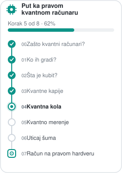

:::{margin}

:::


# Kvantna kola (quantum circuits)

U prošloj lekciji upoznali smo *pojedinačne* kvantne kapije kao matrice $2\times 2$. Sada ćemo videti kako se one nižu jedna za drugom u **kvantno kolo**: dijagram koji se čita kao note, s leva na desno, kroz vreme.

```{figure} ../images/note.png
:label: fig:note
:alt: Koraci u muzici,
:width: 520px
:align: center

Tri koraka svake muzičke kompozicije. Violinski ključ (početak kompozicije), note (sama kompozicija), i kraj (znak za kraj kompozicije). 
```

Kvantno kolo je zapravo „recept" za ceo kvantni proračun: kako da pripremimo, transformišemo i izmerimo kubit.

## Tri koraka svakog kvantnog procesa

Svaki kvantno-mehanički proces (pa i svaki kvantni proračun) sastoji se iz tri koraka:
- **priprema** kvantnog stanja, gde obično krećemo iz $\ket{0}$,
- **evolucija** stanja delovanjem kapija, tj. $\ket{\psi^{\rm novo}} = U\ket{\psi^{\rm staro}}$ iz {eq}`eq:evolution`,
- **merenje** stanja koje daje **klasičan bit** (Bornovom pravilo prikazano u sledećoj lekciji [](05-measurements.md)).

```{figure} ../images/osnove.png
:label: fig:osnove
:alt: Tri koraka kvantnog procesa: priprema, evolucija, merenje.
:width: 520px
:align: center

Tri koraka svakog kvantnog procesa na primeru jednog kubita: **priprema** ($\ket{0}$ na severnom polu Blohove sfere), **evolucija** (kapija $U$ zarotira stanje) i **merenje** (instrument daje klasičan bit $0$ ili $1$).
```

Cilj ove lekcije je da naučimo da čitamo i pišemo ovakve dijagrame, i da ih povežemo sa matricama iz prethodne lekcije.

Ovakav tip diskretne kvantne mehanika deli sličnost sa muzičkim notama kao što smo već videli. 

**Ne treba zaboraviti da najčešće sa merenjem asociramo osu z!** (slučaj superprovodnih kubita)

## Šta je kvantno kolo?

Kvantno kolo je dijagram sa nekoliko jednostavnih pravila:
- **žica** (horizontalna linija) predstavlja jedan kubit; vreme teče **s leva na desno**,
- kubit počinje u stanju $\ket{0}$ na levom kraju,
- **kapije** su kutije (ili simboli) na žici; kad stanje „prođe" kroz kutiju $U$, ono se transformiše u $U\ket{\psi}$,
- na kraju je **merni instrument** (simbol „merača"), koji stanje pretvara u klasičan bit. Klasičan bit vodimo **dvostrukom linijom** da bismo ga razlikovali od kvantne žice.

```{figure} ../images/kolo-osnovno.png
:label: fig:kolo-osnovno
:alt: Jednokjubitno kolo sa kapijama H i T i merenjem.
:width: 380px
:align: center

Tehnički crtež napravljen pomoću [Qiskit](https://www.ibm.com/quantum/qiskit) paketa jednokubitno kolo: kubit $q$ krene iz $\ket{0}$, prođe kroz kapije $H$ i $T$, pa se meri; rezultat (klasičan bit) upisuje se u klasični registar $c$ (dvostruka linija).
```

:::{important} Redosled čitanja
:class: simple
Kolo čitamo **s leva na desno**. Ali kad ga prevodimo u proizvod matrica, redosled se **obrne**: o tome odmah u sledećem odeljku.
:::

Kasnije ćemo videti i kola sa **više žica** (više kubita, jedna iznad druge); zasad ostajemo na jednom kubitu. 

## Kolo je proizvod matrica (redosled je obrnut!)

Neka kolo prvo primeni kapiju $A$, pa $B$, pa $C$ na početno stanje $\ket{\psi^{\rm ulaz}}$. To kolo možemo dijagramatički da predstavimo na sledeći način: 

```{figure} ../images/redosled.png
:label: fig:redosle
:alt: Tri koraka kvantnog procesa: priprema, evolucija, merenje.
:width: 520px
:align: center

Primer kola sa više kapija. Imati na umu da ovo nije kompletna vizuelizacija, već samo delimična sa stanjima na početku i na kraju. Tehnički diagram ne nužno imaju takav zapis. 
```

Pošto svaka naredna kapija deluje na rezultat prethodne, ukupno dejstvo je


```{math}
:label: eq:circuit-order
\ket{\psi^{\rm izlaz}} = C\,\big(B\,(A\ket{\psi^{\rm ulaz}})\big) = \underbrace{C\,B\,A}_{U_{\rm kolo}}\,\ket{\psi^{\rm ulaz}}.
```

Uočite **obrnut redosled**: iako u kolu prvo crtamo $A$, u proizvodu matrica ona stoji **skroz desno** (jer prva deluje na stanje).


### Prethodni primer
Pogledajmo konkretan primer sa [](#fig:kolo-osnovno): kolo $\ket{0}\,\text{–}\,H\,\text{–}\,T\,\text{–}$ (prvo $H$, pa $T$). Njegova matrica je $U_{\rm kolo} = T\,H$ (a **ne** $H\,T$!):

:::{note} Prikaži računicu (klik)
:class: dropdown
Prvo deluje $H$: $\;H\ket{0} = \tfrac{1}{\sqrt2}(\ket{0}+\ket{1}) = \ket{+}$. Zatim deluje $T$:
```{math}
T\,H\ket{0} = T\ket{+} = \tfrac{1}{\sqrt2}\big(\ket{0} + e^{i\pi/4}\ket{1}\big) = \ket{T}.
```
Dobili smo tačno **magično stanje** $\ket{T}$ iz [](03-one-qubit-gates.md)! Da smo greškom pomnožili $H\,T$ (pogrešan redosled), dobili bismo drugačije stanje. Ko je to stanje?
:::

Isto možemo da proverimo na dva načina — „ručno" preko matrica (kao u prošloj lekciji) i preko **Qiskit** kola.

```python
import numpy as np

# matrice kapija (iste kao u prošloj lekciji)
I2 = np.eye(2, dtype=complex)
X  = np.array([[0, 1], [1, 0]], dtype=complex)
Z  = np.array([[1, 0], [0, -1]], dtype=complex)
H  = (1/np.sqrt(2)) * np.array([[1, 1], [1, -1]], dtype=complex)
S  = np.array([[1, 0], [0, 1j]], dtype=complex)
T  = np.array([[1, 0], [0, np.exp(1j*np.pi/4)]], dtype=complex)
ket0 = np.array([[1], [0]], dtype=complex)

def Rz(theta):
    return np.array([[np.exp(-1j*theta/2), 0],
                     [0, np.exp(1j*theta/2)]], dtype=complex)
```

Prvo „ručno", matricama — pazimo na obrnut redosled:

```python
# Kolo |0> --H--T-- ; redosled matrica je OBRNUT od crtanja:
U_kolo = T @ H                 # prvo H, pa T  ->  T·H
psi = U_kolo @ ket0
print("Izlazno stanje =\n", np.round(psi, 3))   # (|0> + e^{i pi/4}|1>)/sqrt(2) = |T>
```


Hajde da obavimo isti račun koristeći QisKit. Gde je prvo potrebno instalirati paket pomoću komande

```python
# instalacije QisKit-a i dodatka zabolju vizuelizaciju
!pip install qiskit 
!pip install pylatexenc
```

A sada isto to kao Qiskit kolo. `QuantumCircuit` sam množi matrice u obrnutom redosledu umesto nas:


```python
# učitati potrebne funkcije iz QisKit paketa
from qiskit import QuantumCircuit
from qiskit.quantum_info import Statevector, Operator

# definisati kvantno kolo
qc = QuantumCircuit(1)
qc.h(0)      # prvo nacrtamo (i primenimo) H
qc.t(0)      # pa T
```


```python
# provera da se Qiskit slaže sa T·H (a ne H·T):
print("Qiskit = T·H ? ", np.allclose(Operator(qc).data, T @ H))
print("Stanje:", np.round(Statevector(qc).data, 3))
```

Vizuelizacija kola iz  [](#fig:kolo-osnovno). 

```python
qc.measure_all()

qc.draw('mpl', style='iqp')

```

:::{danger} U slučaju greške pri izvršenju (klik)
:class: dropdown
U slučaju greške pri puštanju koda, potrebno je restart-ovati 'Runtime session' vašeg Jupiter notebook-a.
:::


## Ekvivalencije kola (identiteti)

Pošto su kola samo proizvodi matrica, algebarska svojstva iz prošle lekcije postaju **dijagramski identiteti**: dva različita kola koja rade istu stvar. Nekoliko korisnih (svi slede iz {eq}`eq:involution` i {eq}`eq:roots`):

| Kolo | Jednako je | Razlog |
|---|---|---|
| $\text{–}H\text{–}H\text{–}$ | $\text{–}$ (prazna žica) | $H^2 = I$ |
| $\text{–}S\text{–}S\text{–}$ | $\text{–}Z\text{–}$ | $S^2 = Z$ |
| $\text{–}T\text{–}T\text{–}T\text{–}T\text{–}$ | $\text{–}Z\text{–}$ | $T^4 = Z$ |
| $\text{–}R_z(\alpha)\text{–}R_z(\beta)\text{–}$ | $\text{–}R_z(\alpha+\beta)\text{–}$ | rotacije oko iste ose se sabiraju |

Kroz kod, možemo proveriti ove identitite pomoću:

```python
print("H·H = I ?    ", np.allclose(H @ H, I2))
print("S·S = Z ?    ", np.allclose(S @ S, Z))
print("T·T·T·T = Z ?", np.allclose(T @ T @ T @ T, Z))
```

## Priprema proizvoljnog stanja kolom

Kolo nam služi i da iz $\ket{0}$ **napravimo** bilo koje željeno stanje. Iz prošle lekcije znamo da opšta kapija $U(\theta,\phi,\lambda)$ iz {eq}`eq:ugate` pokriva sve rotacije, pa jedno kolo $\ket{0}\,\text{–}\,U(\theta,\phi,\lambda)\,\text{–}$ može da dosegne svaku tačku Blohove sfere. Za tačke na ekvatoru dovoljni su $H$ i jedna $R_z$: prvo $H$ (dovede nas na ekvator, u $\ket{+}$), pa $R_z(\varphi)$ (zavrti za azimut $\varphi$).

```python
# Kolo |0> --H--Rz(phi)-- priprema stanje na ekvatoru sa azimutom phi:
phi = np.radians(70)
psi = Rz(phi) @ H @ ket0                 # matrica kola je Rz·H (obrnut redosled!)
azimut = np.degrees(np.angle(psi[1, 0] / psi[0, 0]))
print("Blohov azimut stanja:", round(azimut, 1), "stepeni")   # ~ 70
```

```python
# isto kolo u Qiskit-u:
qc = QuantumCircuit(1)
qc.h(0)
qc.rz(np.radians(70), 0)
print(qc.draw())
```

## Merenje: kraj kola

Na kraju kola merimo kjubit u računskoj bazi $\{\ket{0}, \ket{1}\}$. Po Bornovom pravilu iz [](../dan1/02-qubits.md), verovatnoće ishoda su $p(0) = |\braket{0}{\psi}|^2$ i $p(1) = |\braket{1}{\psi}|^2$, pa *jedno* merenje daje **jedan klasičan bit**. U kolu ga zapisujemo sa `qc.measure(0, 0)`, kao na [](#fig:kolo-osnovno).

Time je „recept" kola potpun: **pripremi, evoluiraj, izmeri**. Kako iz pojedinačnih merenja dobijamo verovatnoće i celo stanje, kako merimo u *drugim* bazama, i kako se kolo pokreće na **pravom** kvantnom računaru je tema naredne lekcije, [](05-measurements.md).

## Vežbe

:::{admonition} Vežba 1
:class: tip
Kolo je $\ket{0}\,\text{–}\,H\,\text{–}\,Z\,\text{–}\,H\,\text{–}$. Napiši njegovu matricu kao proizvod (pazi na redosled!) i pokaži da je jednaka kapiji $X$, tj. da kolo obrće $\ket{0}$ u $\ket{1}$.
:::

:::{admonition} Rešenje
:class: dropdown
Redosled crtanja je $H, Z, H$, pa je matrica kola $U = H\,Z\,H$ (prvo nacrtano stoji skroz desno). Direktnim množenjem se dobija $H Z H = X$, pa $U\ket{0} = X\ket{0} = \ket{1}$. Kolo je, dakle, samo „preobučeni" kvantni NOT.

```python
print("H·Z·H = X ? ", np.allclose(H @ Z @ H, X))

# Qiskit provera preko matrice kola:
qc = QuantumCircuit(1); qc.h(0); qc.z(0); qc.h(0)
print("Operator(qc) = X ? ", np.allclose(Operator(qc).data, X))
```
:::

:::{admonition} Vežba 2
:class: tip
Pokaži da su kola $\text{–}S\text{–}S\text{–}$ i $\text{–}Z\text{–}$ jednaka, a zatim da su $\text{–}T\text{–}T\text{–}$ i $\text{–}S\text{–}$ jednaka. (To su „koreni" iz prošle lekcije, sada kao identiteti kola.)
:::

:::{admonition} Rešenje
:class: dropdown
Iz {eq}`eq:roots` je $S^2 = Z$ i $T^2 = S$, pa dva $S$ u nizu daju $Z$, a dva $T$ daju $S$. Dva uzastopna „pola-obrta" oko $z$-ose slože se u jedan pun.

```python
print("S·S = Z ? ", np.allclose(S @ S, Z))
print("T·T = S ? ", np.allclose(T @ T, S))
```
:::

:::{admonition} Vežba 3
:class: tip
Napravi kolo koje iz $\ket{0}$ priprema stanje $\ket{-} = \tfrac{1}{\sqrt2}(\ket{0}-\ket{1})$. Proveri i preko matrica i u Qiskit-u.
:::

:::{admonition} Rešenje
:class: dropdown
Najkraće je $\ket{-} = Z\ket{+} = Z\,H\ket{0}$, tj. kolo $\ket{0}\,\text{–}\,H\,\text{–}\,Z\,\text{–}$ sa matricom $Z\,H$. (Podjednako radi i $\ket{0}\,\text{–}\,X\,\text{–}\,H\,\text{–}$, jer $\ket{-}=H\ket{1}$.)

```python
ket1  = np.array([[0], [1]], dtype=complex)
minus = (ket0 - ket1)/np.sqrt(2)
print("Kolo Z·H daje |-> ? ", np.allclose(Z @ H @ ket0, minus))

# Qiskit:
qc = QuantumCircuit(1); qc.h(0); qc.z(0)
print("Stanje:", np.round(Statevector(qc).data, 3))   # (1, -1)/sqrt(2) = |->
```
:::
